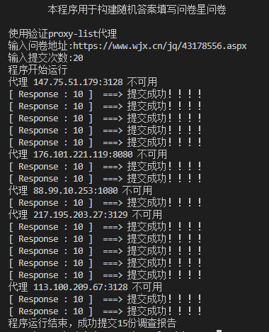
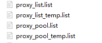

[](https://gitpod.io/#https://github.com/NormanBB/WJX_Autosubmit) 

# WJX_Autosubmit

问卷星自动提交，Python3版本，2020年8月仍有效。采用构建随机答案，不支持验证码。

目前github上的可用版本并不多，同时个人接触较多问卷星的问卷，便萌生了用Python3的爬虫来完成问卷的想法，同时，作为学习的项目。

## 程序运行

1. 安装依赖。

> pip install -r requirements.txt

### 帮助信息

```
    Usage: WJX_Autosubmit.py [OPTIONS]

    Options:
    -p or --pool   use proxy from github.com/jhao104/proxy_pool
    -l or --list   use proxy from www.proxy-list.download
    -h or --help  Show this message and exit.
```

### 使用例子



### 说明

如上图所示，20份问卷中有5份由于代理不可用而提交失败（有些时候，程序出现异常跳过会导致总数不一致的情况）。目前项目提供两个代理来源选择，在抓取所选来源的代理后，会进行一次校验。尽管源头已进行过筛选，但是依然有出现代理不可用的情况。在向问卷星进行提交时，筛选过的代理依然会出现代理不可用的情况。目前在每次运行程序完成时，会将无效代理从代理存储文件中删除，当程序运行次数越多，就可以达成有效提交次数越多的情况。

强烈建议代理存储文件仅当天保留，之后运行时可删除，程序会自行从所选代理来源抓取新的代理。

当然也可以自己采用付费https代理。

### 重要说明

**请优先采取使用proxy-list的代理。**

#### 代理存储文件



如选择从 proxy_list 获取代理，程序会先保存为 ` proxy_list.list `,将验证后代理保存为 ` proxy_pool_temp.list `。

这两个代理来源的区别是，proxy_list 的有效代理数量更多，国外代理的数量相比国内更多，proxy_pool则相反。

## 鸣谢

- [简书：Python填写问卷星]( https://www.jianshu.com/p/34961ceedcb4)
- [Python笔记（六）--Python3通过post方法实现自动提交问卷星调查问卷](http://www.pianshen.com/article/6056350400/)
- [WJXAutoSubmit](https://github.com/huanxyx/WJXAutoSubmit )
- [Free_Proxy_Website](https://github.com/cyubuchen/Free_Proxy_Website)
- [问卷星项目](https://github.com/tignioj/test_login/tree/master/wjx) 

## Bugs

程序仅支持固定问题的问卷，并不支持问题动态变化的问卷。

欢迎对不同种类问卷进行适配并提交pull request.

在此推荐一个适配多种题型的项目。

- [自动填写问卷并提交,然后自动刷新继续填写](https://github.com/ZainCheung/wenjuanxin)

### 更新日志

#### V 1.0  2019年8月9日完成

- 使用西刺代理。

#### 2.0  2020年8月20日完成

- 更换代理来源
- 引入多线程验证
- 增加启动参数
- 匹配问卷星新headers。
- 自定义模块使用面向对象方法

~~年更，逃~~
